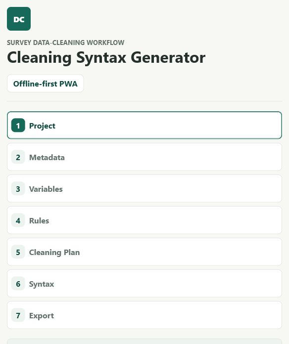
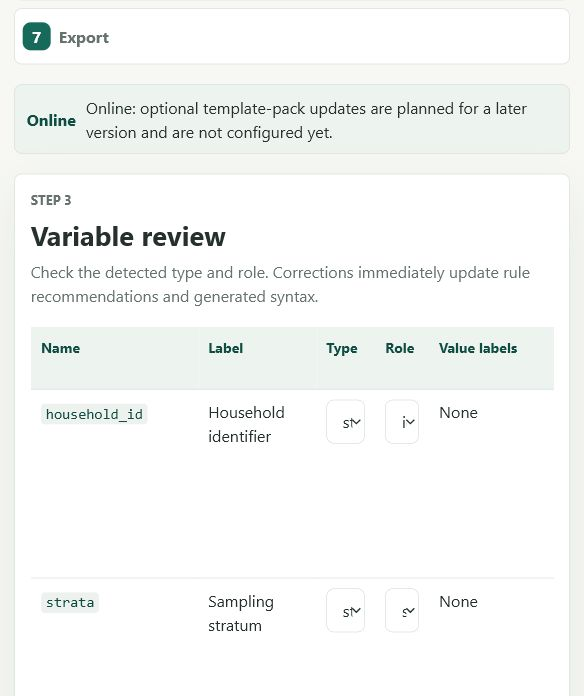
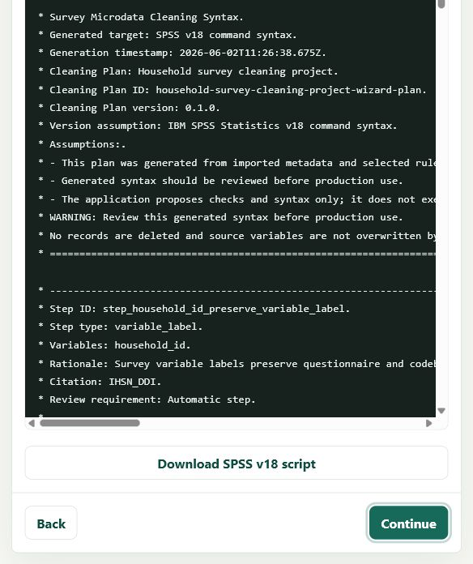
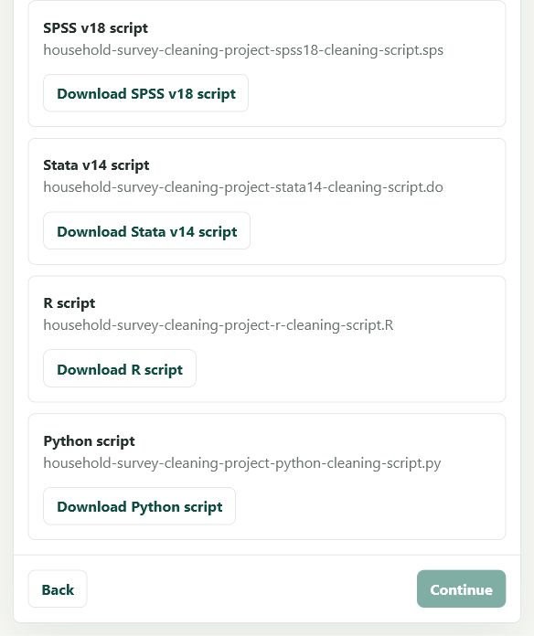

# Survey Data Cleaning Syntax Generator

An open-source, offline-first web app for turning survey metadata into
reviewable data-cleaning syntax.

The app is for official statisticians, survey operations teams, data managers,
and analysts who need a transparent first draft of cleaning and imputation
syntax from a data dictionary. It does not clean data directly and it does not
execute generated scripts. Instead, it builds a language-neutral Cleaning Plan
from imported metadata, then renders syntax that a human analyst can review,
adapt, and run in their own statistical environment.

## What It Generates

- SPSS v18 syntax
- Stata v14 do-files
- R scripts
- Python scripts
- Cleaning Plan JSON
- Plain-language summary reports

## Metadata Inputs

- CSV dictionary files
- Excel `.xlsx` dictionary files
- DDI XML Codebook metadata files
- Stata `.dta` metadata paths
- SPSS `.sav` metadata paths
- Pasted CSV dictionary text
- Built-in synthetic official-statistics demo dictionaries
- Manual variable entry

The current release focuses on metadata-driven checks, rule review, syntax
preview, and local export. DDI XML support is an MVP Codebook importer for
common survey metadata structures; it is not full DDI lifecycle support. SPSS
and Stata package-file support is metadata-only and conservative: the app tries
to read dictionary/header metadata locally in the browser, does not import
observation-level records into app state, and warns users to prefer exported
CSV/Excel dictionaries when confidentiality rules prohibit opening full data
files.
Renderer coverage is documented in the
[Renderer Support Matrix](docs/renderer-support-matrix.md), including partial
support and known limitations by Cleaning Plan step type and target language.

## Screenshots









## Offline And Privacy Principles

The app is a static Progressive Web App. After one successful online load, the
browser can cache the app shell and reopen it offline. The demo dictionary,
pasted metadata, local CSV/XLSX/XML/DTA/SAV uploads, rule review, Cleaning Plan
generation, syntax previews, and downloads all run locally in the browser.

Uploaded dictionaries or package files, generated Cleaning Plans, scripts, and
reports are not uploaded to a server. The project has no backend service,
authentication, telemetry, analytics, cloud storage, or remote logging.

## Quick Start

Install dependencies:

```powershell
npm install
```

Run the development server:

```powershell
npm run dev
```

Run tests:

```powershell
npm test
```

Run browser-level workflow tests:

```powershell
npm run test:e2e
```

Build the production app:

```powershell
npm run build
```

Preview the production build:

```powershell
npm run preview
```

Recommended release checks:

```powershell
npm run lint
npm run format
npm test
npm run test:e2e
npm run build
npm audit --omit=dev
```

## GitHub Pages

Live public demo:

```text
https://bakodramane.github.io/DATA_CLEANING_SYNTAX_APP/
```

The Vite configuration uses a relative default base path (`./`), which is safe
for static hosting and GitHub Pages subpath deployments. If a deployment needs
an explicit repository base path, set `VITE_BASE_PATH` before building:

```powershell
$env:VITE_BASE_PATH='/DATA_CLEANING_SYNTAX_APP/'
npm run build
```

See [GitHub Pages Deployment](docs/github-pages.md) for setup notes and the
manual deployment workflow. See the
[v0.4.2 deployment validation note](docs/deployment-validation-v0.4.2.md) for
the latest public-demo validation result.

## Current Limitations

- Generated syntax must be reviewed before production use.
- The app generates syntax; it does not execute scripts or clean datasets.
- DDI XML import supports common DDI Codebook structures only. Users must
  review detected variable types, roles, value labels, missing codes, valid
  ranges, and source notes before using generated syntax.
- Stata `.dta` import supports conservative metadata extraction for tagged
  v117-v119-style files. Value-label tables and extended missing semantics may
  require an exported dictionary.
- SPSS `.sav` import supports classic SAV dictionary metadata, including simple
  value labels and user-missing values where present. Unsupported records return
  warnings and a CSV/Excel fallback message.
- Full DDI lifecycle support and every DDI version or edge case are not
  implemented.
- Observation-level data profiling is not implemented.
- Manual entry is variable-by-variable and does not yet import saved manual
  entry sessions.
- AI-assisted interpretation, online rule-pack fetching, backend services,
  authentication, telemetry, analytics, and cloud storage are not implemented.
- Some renderer support is partial for advanced imputation and specialist rule
  types. See the [Renderer Support Matrix](docs/renderer-support-matrix.md).
- Browser install prompts and offline indicators vary by browser and platform.

## Contributing

Contributions are welcome. Start with [CONTRIBUTING.md](CONTRIBUTING.md), then
see:

- [User Guide](docs/user-guide.md)
- [Importer Support Matrix](docs/importer-support-matrix.md)
- [Renderer Support Matrix](docs/renderer-support-matrix.md)
- [Importing SPSS And Stata Metadata](docs/importing-spss-stata.md)
- [Architecture](docs/architecture.md)
- [Methodology](docs/methodology.md)
- [Official Statistics Review Guide](docs/official-statistics-review.md)
- [Phase 16 Official-Statistics Examples](docs/phase-16-examples.md)
- [References](docs/references.md)
- [Offline Mode](docs/offline-mode.md)
- [Adding a Rule](docs/adding-a-rule.md)
- [Adding a Renderer](docs/adding-a-renderer.md)
- [Release Checklist](docs/release-checklist.md)
- [Post-Release QA](docs/post-release-qa-v0.1.0.md)
- [Roadmap](docs/roadmap.md)
